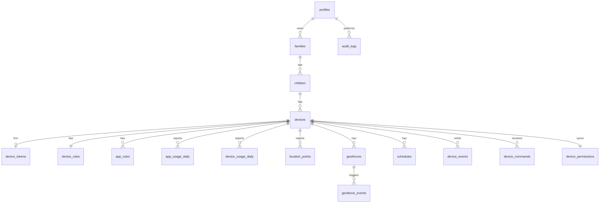

# ARCHITECTURE

## 1. Repository status
Greenfield project. Monorepo created in Phase 1.

## 2. Folder structure (target)
```
familysafe/
├─ prompt.md  plan.md  README.md
├─ apps/
│  ├─ web/                         Next.js (App Router) — Phase 5+ (no `src/` dir; `@/*` → apps/web/*)
│  │  ├─ app/(auth)/{login,signup,forgot-password,reset-password,verify-email,mfa}
│  │  ├─ app/(app)/{dashboard,children,devices,notifications,audit-logs,settings}   (shell layout + auth guard)
│  │  ├─ app/(app)/devices/[id]/{overview,usage,applications,location,geofences,permissions,rules,schedules,activity}
│  │  ├─ components/{ui,auth,shell}  (charts/maps arrive with their phases)
│  │  ├─ lib/{auth,supabase,security,nav,theme,ids}
│  │  └─ server actions live beside their feature (`lib/*/actions.ts`); no service key in the browser
│  └─ android/                     Kotlin, Gradle version catalog — Phase 9+
│     └─ app/src/main/java/app/familysafe/child/
│        ├─ core/{di,network,security,logging,time}
│        ├─ data/{local(Room),remote(Retrofit/OkHttp),repository}
│        ├─ domain/{model,usecase,rules(RuleEngine)}
│        ├─ feature/{enrollment,status,permissions,safety,sync,about}
│        ├─ platform/{usage,location,geofence,apps,dpm,fcm,camera,audio}
│        └─ work/{HeartbeatWorker,SyncWorker,UsageUploadWorker}
├─ supabase/
│  ├─ config.toml
│  ├─ migrations/                  ordered SQL — Phase 3/4
│  ├─ functions/
│  │  ├─ _shared/{cors,errors,validate,auth,ratelimit,fcm}
│  │  ├─ parent-api/  device-api/  internal-jobs/
│  └─ tests/                       pgTAP RLS tests
├─ packages/contracts/             Zod schemas + TS types shared by web/functions
├─ docs/  scripts/  .github/workflows/
```

## 3. System architecture
```
Parent Web (Next.js) ──HTTPS──▶ Supabase Auth + PostgREST/Edge Fn ──▶ PostgreSQL (RLS)
                                         │                                  ▲
                                         │ FCM (wake-up only, no PII)       │ HTTPS (device JWT)
                                         ▼                                  │
                                   Child Android App ◀──────────────────────┘
                                         │
                                   Android OS APIs
```
- Two trust domains: **Parent** (Supabase Auth JWT, RLS on `auth.uid()`) and **Device** (custom device JWT minted by `device-api`, never valid on parent endpoints; claim `role=device`, `device_id`).
- Devices never hit tables directly; all device writes go through `device-api` Edge Functions using the service role after device-JWT verification + per-device scoping.
- Command flow: parent action → row in `device_commands` (+ rule change) → FCM `{type:"SYNC"}` → device authenticates → `GET /device/commands` → validate (signature/nonce/expiry) → execute → `POST ack`.
- Replay protection: per-command `nonce`, `expires_at`, status state machine (PENDING→DELIVERED→EXECUTED/FAILED/EXPIRED), device stores last-seen command sequence.
- Offline: Room caches last valid config with `valid_until` (config TTL, default 72h) → after TTL the RuleEngine falls back to the safest configured default (parent-selectable: keep last / restrictive).

## 4. Database ERD

Planned additions (not in the prompt's list, needed for the design): `pairing_tokens` (hash, expiry, used_at), `device_credentials` (refresh-token hash, rotation family, revoked_at), `installed_apps`, `notifications`, `notification_preferences`, `retention_settings`, `rate_limits`, `emergency_alerts`, `emergency_contacts`. Each is introduced in the phase that needs it.

## 5. API architecture
Three surfaces, three auth schemes:
| Surface | Base | Auth | Consumers |
|---|---|---|---|
| Parent API | `/functions/v1/parent-api/*` + PostgREST under RLS | Supabase JWT | Web |
| Device API | `/functions/v1/device-api/*` | Device JWT (15 min) + rotating refresh | Android |
| Internal | `/functions/v1/internal-jobs/*` | cron secret / service role only | pg_cron, retention |
Every handler: Zod-validate → authn → authz (resource ownership) → rate-limit → execute → audit → typed envelope `{data}|{error:{code,message}}`. Endpoint list: see `API.md`.

## 6. Android architecture
Single-module app (split later if needed), package `app.familysafe.child`, `minSdk 31`, Kotlin + Jetpack Compose + Material 3. Layers: `domain/` (pure state: `ChildAppState`, `EnrollmentState`, `SyncStatus`, `PermissionCatalog`), `config/` (`ApiBaseUrl`: https only, cleartext solely for emulator loopback in debug), `data/` (`SecureStore` interface; `AesGcmSealer` AES-256-GCM with the key name bound as AAD; `SealedSecureStore`; Keystore key + private SharedPreferences for sealed blobs), `di/` (**manual `AppContainer`, no Hilt/kapt**, lazy members), `work/` (`WorkScheduler`, `HeartbeatWorker`, `HeartbeatRunner` — see §11), `ui/` (Navigation Compose, six stateless screens: Device status, Permissions, Enrollment, Sync status, Safety, About). Phase 10 adds enrollment: `domain/` (`PairingCode`, `DeviceInfo`, `EnrollmentFailure`), `data/` (`EnrollmentApi` interface + `KtorEnrollmentApi`, `RedeemHttpMapper` and `NetworkFailureClassifier` as pure rules, `CredentialStore` over `SecureStore`, `EnrollmentRepository`), `di/AppStateHolder` (app-wide `StateFlow<ChildAppState>`), and the first view-model (`EnrollmentViewModel` + pure `EnrollmentUiState`). The redeem call runs in an application-lifetime scope, not `viewModelScope`, so leaving the screen cannot cancel a request whose code the server already spent.

Decisions: API client = Ktor (OkHttp engine) + kotlinx.serialization (added in Phase 10: no logging, retry or redirect plugins; connect 10 s / request 20 s). `API_BASE_URL` comes from `BuildConfig` (`-Pfamilysafe.apiBaseUrl`; release requires https), because the pairing QR carries only the code. Later phases add Room (rules cache, outbox), the FCM service (wake-up → expedited sync), `RuleEngine` (pure Kotlin) and an `Enforcer` interface with `ConsumerEnforcer` (Track A) and `ManagedEnforcer` (Track B, DevicePolicyManager). Only the launcher activity is exported.

## 7. Deployment tracks
- **Track A — Consumer Play app.** No system privileges. Enforcement via UsageStats + overlay/block screen, notifications, FGS(location) where declared.
- **Track B — Managed / Device Owner** (QR/NFC/zero-touch provisioning on factory-reset device, enterprise or private distribution). Adds suspend/hide apps, lock task, uninstall protection (visible to user), managed config.
Details: `ANDROID_PERMISSIONS.md`.


## 8. Web app shell and data access (Phase 6)
**Shell.** `(app)/layout.tsx` keeps the server-side auth guard, then renders `AppShell`: fixed sidebar ≥ lg; below lg a native `<dialog>` drawer (focus trap, Esc, focus restore built in); sticky header with breadcrumbs (`lib/nav.ts`) and an account menu (email, Security, Settings, theme, Sign out). Navigation and breadcrumbs are pure config in `lib/nav.ts`. Entity ids never appear in the UI; names are supplied later via `buildBreadcrumbs(path, labels)`.
**Theme.** `system|light|dark` in the HttpOnly `fs-theme` cookie, rendered as a class on `<html>` by the root layout; "system" adds no class and CSS follows `prefers-color-scheme`. No inline script, so the nonce-only CSP is unchanged.
**How browser components get data (decision).** All reads and writes go through Server Components and Server Actions using `createSupabaseServerClient()` (the parent's JWT from the HttpOnly cookies, so RLS applies). The browser never holds a Supabase token and `lib/supabase/client.ts` is not used for data. Live status (online/offline, battery) will use a small client component that calls `router.refresh()` on an interval (paused while the tab is hidden) — no browser token needed. Sensitive reads (location, Phase 21/22) go through an audited Edge Function/RPC that writes `LOCATION_VIEWED`. If true push (Realtime) is ever needed, revisit: it requires a short-lived token to the browser, which must be a deliberate, separately reviewed decision.
**Dependencies.** No new npm packages: sheet/dropdown/breadcrumb behaviour is hand-rolled on native elements; `badge`, `skeleton`, `separator` added to `components/ui`.

## 9. Device enrollment (Phase 8)
```
Parent (browser) ── Server Action ──► Next server ──(parent JWT)──► enrollment-create ──► RPC enrollment_create_token
Child app ─────────(pairing code)──────────────────────────────────► enrollment-redeem ──► RPC enrollment_redeem (1 txn)
Parent (browser) ── Server Action ──► Next server ──(parent JWT)──► device-revoke ─────► RPC enrollment_revoke_device
```
Edge Functions authenticate first (parent JWT, or the code itself for redeem), then call SECURITY DEFINER functions with the service role; the database decides ownership and guarantees single use. Parent surface and device surface stay separate: device JWTs are rejected on parent functions, and the redeem endpoint ignores `Authorization` entirely. Details: docs/API.md ("Device enrollment"), docs/SECURITY.md (Phase 8 controls).


## 10. Device authentication (Phase 11)
```
Child app ──(refresh token)──► device-refresh ──► RPC device_refresh (1 txn: rotate | reuse→revoke family | invalid)
Child app ──(access JWT)─────► any device endpoint (Phase 12+) ──► requireActiveDevice ──► RPC device_authorize (every request)
```
Access JWT (15 min) proves who signed; the live-credential lookup proves the credential is still allowed, so revocation takes effect on the next request. The Android side (Phase 11b) is `data/TokenProvider` (memory-only access token, single-flight refresh under one `Mutex`, new refresh token persisted **before** the new access token is exposed, network call + save run in `NonCancellable`), `data/AuthenticatedExecutor` + `KtorDeviceHttp` (the only code that sets `Bearer`), and `domain/DeviceAuthState` (`Unknown | Connected | Revoked | Expired | Uncertain`; the last three mean "disconnected"). `AppStateHolder` combines enrollment with the observed auth state, so a revocation found by any call reaches the screens. A disconnect reason (state name, no secret) is stored so the explanation survives a restart. Details: docs/API.md ("Device authentication"), docs/SECURITY.md (Phase 11 controls).

## 11. Heartbeat (Phase 12)
```
Child app (WorkManager, ~15 min) ──(access JWT)──► device-heartbeat ──► requireActiveDevice ──► RPC device_heartbeat (1 txn)
                                                                           └► devices row + DEVICE_ONLINE / BATTERY_LOW events
Web (Phase 12c): device_status + last_seen_at → "online" only if last_seen_at is within 2700 s (pure rule, same constant as HEARTBEAT_STALE_SECONDS)
```
Split: 12a backend, 12b Android worker, 12c web display. The beat is coarse by design (versions, battery, charging, network type); server time is the only clock that matters.

**Web side (Phase 12c).** `lib/devices/status.ts` is the single rule set (pure, imports `HEARTBEAT_STALE_SECONDS` from contracts): `revoked`/`pending` win; no `last_seen_at` → `waiting` ("Waiting for first check-in"); `online` only if `device_status = ONLINE` **and** age ≤ 2700 s (a future timestamp = clock skew = age 0); otherwise `offline`. Battery text/low flag (≤ 15 and not charging, same as `BATTERY_LOW`), network labels and `summarizeDevices` (online/offline/waiting counts, lowest battery among active devices) live there too. Reads: `lib/devices/queries.ts` (`fetchAllDevices`, `fetchDevice`) run as the parent under RLS on `DEVICE_COLUMNS` (heartbeat columns, never push/credential columns). Pages: `/devices`, `/devices/[id]/overview`, the device list on `/children/[id]`, and the dashboard cards (Devices online / offline, Battery). Live-ish updates: client `AutoRefresh` → `router.refresh()` every 60 s, paused while the tab is hidden, immediate refresh on becoming visible (`lib/devices/auto-refresh.ts`, pure and tested). No Realtime, no browser token.

**Android side (Phase 12b).** `domain/HeartbeatPayload` (+ pure `BatteryMath`, `NetworkTypeMapper`, `HeartbeatPolicy.shouldRun`: enrolled and not disconnected), `data/` (`HeartbeatRepository` over the `DeviceHttp` interface implemented by `KtorDeviceHttp`, pure `HeartbeatHttpMapper`, `HeartbeatDtos`, `SyncStatusStore` for "last sync", `AndroidHeartbeatPayloadSource` reading the sticky battery broadcast and `ConnectivityManager`), `work/` (`HeartbeatRunner` = collect → send → remember → result; `HeartbeatWorker` maps the result to WorkManager; `WorkScheduler.ensureHeartbeat/cancelHeartbeat`). `AppContainer.startBackgroundWork()` observes `AppStateHolder.state` and schedules (`KEEP`) or cancels the job whenever `HeartbeatPolicy.shouldRun` changes. `AppStateHolder` now also combines the sync status, so the Sync status screen shows the real last sync time and a plain-words list of what a check-in contains.


## 12. Device information (Phase 13)
**Split:** 13a backend (this), 13b Android upload + "Device status" transparency list, 13c web "Device information" card on `/devices/[id]/overview`.
**Decision — separate upload, not part of the heartbeat.** These facts change rarely (an OS update, a full disk), so a daily `device-info` upload (`DEVICE_INFO_INTERVAL_SECONDS = 86400`) keeps the 15-minute beat minimal. Fields are limited to what Android exposes with **no runtime permission**: API level (`Build.VERSION.SDK_INT`), security patch date (`Build.VERSION.SECURITY_PATCH`), total/free internal storage in MB (`StatFs`). Deliberately not collected: serial, IMEI, advertising id, MAC/IP address, installed apps, RAM (PRD §38: device identifiers are sensitive; RAM is not clearly useful to a parent).
Storage: five nullable columns on `devices` (`sdk_level`, `security_patch`, `storage_total_mb`, `storage_free_mb`, `info_updated_at`) with CHECKs (ranges, pair-or-null, free ≤ total). Parents already `SELECT` `devices` under RLS (table-level grant) so no policy change is needed; they still cannot write these columns (update grant stays `device_name` only). Contract: `packages/contracts/src/device-info.ts`, mirrored in `supabase/functions/_shared/device-info.ts` (drift + SQL-limit tests).

### 12b. Android upload (Phase 13b)
`DeviceInfoWorker` (unique periodic work `device-info`, 24 h, `CONNECTED`, `KEEP`, exponential backoff; first run as soon as it is enqueued) → `DeviceInfoRunner` → `DeviceInfoRepository` → `DeviceHttp` (`POST device-info`). Scheduled/cancelled together with the heartbeat by `HeartbeatPolicy` in `AppContainer.startBackgroundWork()`. After an OS or patch update (`DeviceInfoPolicy.needsUploadNow`: API level or patch date differs from the last acknowledged report) one extra unique one-time job `device-info-now` is queued; with no report yet the periodic job's immediate first run covers it. Outcome mapping equals the heartbeat's (2xx sent; 401/429/5xx/offline → retry; other 4xx → failure for this run; not enrolled/disconnected → stop, report cleared). Values come from `Build.VERSION.SDK_INT`, `Build.VERSION.SECURITY_PATCH`, `StatFs(dataDirectory)` (MiB = bytes / 1 048 576); `DeviceDetails.sanitized()` degrades anything doubtful to `null` (unparseable or future patch date, inconsistent storage pair) and rejects only an unusable API level. `DeviceInfoReportStore` keeps the last acknowledged values + time (one sealed string) for the Device status screen.

### 12c. Web card (Phase 13c)
`/devices/[id]/overview` renders `DeviceInfoCard` under the status card. Rules live in `lib/devices/info.ts` (pure; limits and the 86 400 s interval come from contracts): "Not reported yet" until `info_updated_at` is valid, else "Updated N ago" (shared relative wording); a note appears after 3 missed daily uploads (`INFO_STALE_SECONDS`). System = `Android <version> · API level <n>`; patch date as `5 September 2026`; patch hint by age in UTC days (≤ 90 recent, no text; 91–180 "check for a system update soon"; > 180 "check for a system update") and never says "secure"/"vulnerable"; storage bar (`role=progressbar`, `aria-valuetext`) only for a consistent pair (total ≥ 1, 0 ≤ free ≤ total), otherwise "Unknown". `DEVICE_COLUMNS`/`DeviceRow` gained the five columns (nulls stay null). No migration, Edge, contracts or Android change.

## 13. Permission state sync (Phase 14a, backend)
The app reports the OS grant state of the 8 catalog permissions to `POST device-permissions` (every 6 h and on app resume; `PERMISSION_SYNC_INTERVAL_SECONDS = 21600`). `device_update_permissions(device, states jsonb)` (service_role only, `SECURITY DEFINER`, empty `search_path`) locks `devices` → `device_permissions`, validates exactly the catalog keys and CHECK-listed states, and diffs against the stored row. Unchanged → only `last_verified_at` moves (no event, no audit). Changed → one `PERMISSION_STATE_CHANGED` device event per permission (`{permission, from, to}`) and one `PERMISSION_STATE_CHANGED` audit row per call (`{changes:[…]}`, no IP). Never touches `device_status`/`last_seen_at`. Android reader = 14b, web display = 14c.

### 13b. Android sync (Phase 14b)
`PermissionSyncWorker` (unique periodic work `permission-sync`, 6 h = `PermissionSyncLimits.INTERVAL_HOURS`, `CONNECTED`, `KEEP`, exponential backoff; first run as soon as it is enqueued) → `PermissionSyncRunner` → `PermissionStateReader` + `PermissionSyncRepository` → `DeviceHttp` (`POST device-permissions`). Scheduled/cancelled with the heartbeat by `HeartbeatPolicy` in `AppContainer.startBackgroundWork()`. `MainActivity.onResume` calls `AppContainer.onAppResumed()`: re-reads the OS state (no prompt), updates the Permissions screen, and queues the unique one-time job `permission-sync-now` (`KEEP`) only while enrolled and not disconnected **and** `PermissionSyncPolicy.needsUploadNow` (nothing acknowledged yet, state differs from the last acknowledged one, or the last acknowledged sync is ≥ 30 min old) — far below the server's 12/hour limit. Outcome mapping equals the heartbeat's (2xx sent; 401/429/5xx/offline → retry; other 4xx → failure for this run; not enrolled/disconnected → stop, report cleared).
State rules (`PermissionStateMapper`, pure): not available on this device/build → `NOT_AVAILABLE`; granted → `GRANTED`; not granted but seen granted before → `REVOKED`; not granted and the app asked before → `DENIED`; else `NOT_REQUESTED`. `RESTRICTED` is never produced (no API used here reports it). `PermissionHistoryStore` (one sealed string `g:…;r:…`) keeps the "seen granted" and "asked" sets; later phases call `markRequested` right before showing a prompt. `AndroidPermissionProbe` only uses `checkSelfPermission` and `hasSystemFeature`; SMS and call log are always `NOT_AVAILABLE` (Track A: Play-restricted, never declared). `location` = fine or coarse; `precise_location` = fine; `background_location` = `ACCESS_BACKGROUND_LOCATION`. `PermissionStateStore` holds the latest reading (memory) and the last acknowledged report (one sealed string `permission_sync_report`) for the Permissions screen. `PermissionKey.wireName` links the app catalog to the contract keys; `USAGE_ACCESS`, `APP_LIST`, `NOTIFICATIONS` stay on the device.

### 13c. Web page (Phase 14c)
`/devices/[id]/permissions` renders `PermissionsCard`. Data: `fetchDevicePermissions` (`lib/devices/queries.ts`) reads the single `device_permissions` row for the device under the parent's RLS (`SELECT` only; the select list is `PERMISSION_COLUMNS`, derived from the contract's `PERMISSION_KEYS` + `last_verified_at`, never a secret column). Rules live in `lib/devices/permissions.ts` (pure): the stored defaults are placeholders, so **until `last_verified_at` parses no state is claimed** ("Not reported yet"); afterwards each of the 8 permissions shows its state label + one sentence (`Allowed`, `Not allowed`, `Turned off`, `Limited`, `Not available`, `Not asked yet`) in contract order, and a value outside the CHECK list shows "Unknown" (never invented). Freshness reuses `formatLastSeen` ("Updated N ago"); a note appears after three missed syncs (`PERMISSION_SYNC_INTERVAL_SECONDS * 3` = 18 h). A `REVOKED` permission raises a low-key outline badge + one sentence at the top of the card (only `REVOKED`; `DENIED`/`RESTRICTED` do not). Wording is informational (what Android reported, not proof, never "secure"); SMS / call history show the Play-restriction sentence. The page validates the id (`isUuid`), answers 404 for a foreign/missing id, and uses the shared 60 s `AutoRefresh`. No new endpoint, migration, dependency or Android change.

## 14. App inventory (Phase 15a-2, Edge + contracts)
The app will report the launchable apps installed on the device to `POST device-apps` (complete list, full replace; `DEVICE_APPS_INTERVAL_SECONDS = 86400`, `DEVICE_APPS_MAX = 500`). Contract: `packages/contracts/src/device-apps.ts`, mirrored in `supabase/functions/_shared/device-apps.ts`; drift tests read the mirror, the SQL limits (cap, field lengths, package-name pattern, entry keys) and the RPC parameter names used by `device-apps/index.ts`. Handler order = method → `RULES.deviceAppsIp` (60/5 min, pre-auth) → `requireActiveDevice` (live credential check) → `RULES.deviceApps` (12/h per device) → strict body (`DEVICE_APPS_MAX_BODY_BYTES` = 1 MiB) → `device_sync_apps` → `{ server_time, next_interval_seconds }`. A device that became inactive between the guard and the write gets the same 401 as any failed authentication. Stored fields: package name, label, version name, system flag (no icons, install time, usage). Android reader/worker = 15b; web list = 15c.

### 14b. Android reader + worker (Phase 15b)
`AndroidInstalledAppsSource` (launcher-intent `PackageManager` query; manifest `<queries>`, no permission) → `AppInventorySanitizer` (contract rules, deterministic cap of 500 by package name, `omittedCount`) → `AppInventoryRepository` (`DeviceHttp.postJson("device-apps")`, single source of truth for the wire form; `AppInventoryDtos` keeps explicit nulls) → `AppInventoryHttpMapper` (pure; same rules as device-info/heartbeat) → `AppInventoryRunner` (records `AppInventoryReport` in `AppInventoryReportStore` only after the server acknowledged it). Scheduling: unique periodic `app-inventory` (24 h, `CONNECTED`, `KEEP`, backoff 1 min) under the same `HeartbeatPolicy` as the other jobs, plus a one-off `app-inventory-now` queued by `AppContainer.queueAppInventoryIfChanged()` on start and resume (throttled by `AppInventoryPolicy.shouldCheck`, 15 min) only when a report exists and its fingerprint differs from the current list. `AppStateHolder` pairs `deviceInfo` with `appInventory` before `combine` (five-flow overload limit). The Device status screen lists the acknowledged apps. Web list = 15c.

### 14c. Web page (Phase 15c)
`/devices/[id]/applications` is a Server Component page (id validated with `isUuid`, 404 for missing/foreign via RLS, `BreadcrumbLabel`, shared 60 s `AutoRefresh`). `fetchDeviceApps` reads `devices.apps_synced_at` and `device_apps` (columns `package_name,label,version_name,is_system`, ordered by package name, `limit DEVICE_APPS_MAX`) with the parent's own session; the page file holds no Supabase code. Search and the user/system filter are a plain `GET` form (`?q=&kind=`): `parseAppsQuery` (pure) drops control characters, trims, caps the text at 100 characters and maps unknown `kind` values to `all`; `filterApps`/`sortApps` match case-insensitively on label or package name as plain text (no pattern). No client JS, no write controls. Before the first report (`apps_synced_at` NULL) nothing is claimed ("Not reported yet"); an empty reported list reads "No apps reported". Stale note after `DEVICE_APPS_INTERVAL_SECONDS * 3`; a cap note appears when the list is at `DEVICE_APPS_MAX`. Block/limit controls come with 18b on this same page.

## 15. Usage statistics (Phase 16a — backend; Android = 16b, web = 16c)
One migration `20260930001500_device_usage.sql` adds `devices.usage_synced_at` and `device_upload_usage(device, day, jsonb)` (SECURITY DEFINER, empty `search_path`, `service_role` only) over the existing `device_usage_daily` / `app_usage_daily` tables. One report = one calendar day (`day`, chosen by the app in the child's local time) for the device in the JWT: `{day, total_screen_minutes, unlock_count, apps:[{package_name, foreground_minutes, launch_count}]}`. **Idempotent merge:** per column the stored value becomes `GREATEST(stored, reported)` and nothing is ever deleted, so retries and re-ordered uploads cannot lower a day's numbers (usage of a day only grows); an app missing from a later report keeps its row. Bounds (violation = 400 at the Edge, `22023` in SQL, nothing truncated): day in `[today-14, today+1]` (UTC date; late upload after being offline / time-zone slack), 0–1440 minutes, 0–10000 unlocks/launches, ≤ 200 apps, no duplicate packages, app minutes sum ≤ 1440. The Edge function `device-usage` (`verify_jwt=false`, `requireActiveDevice` on every request, per-IP 60/5 min pre-auth, per-device 12/h) checks the same day window with `isUsageDayInRange` so the database never has to reject a day the Edge accepted. Response = `{server_time, next_interval_seconds: 21600}` only. Usage reports never touch `device_status`/`last_seen_at` (heartbeat stays the only liveness signal) and write no device event or audit row. Retention (90 days) is a Phase 32 cleanup job; the purge indexes on `usage_date` already exist.

### 15b. Android collector + worker (Phase 16b)
`UsageAccessSettings` (opens Android's Usage Access list; never grants) → `AndroidUsageAccessProbe` (`AppOpsManager`, no prompt) → `AndroidUsageStatsSource` (`UsageStatsManager.queryEvents`, five event types, package + time only) → `UsageEventAggregator` (pure: foreground intervals, launches, screen-on minutes, unlocks; events outside the window ignored; open intervals close at the window end; a missing start is ignored so numbers can only be too low) → `UsageSanitizer` (contract rules; **cap decision:** apps ranked by minutes, then launches, then package name; kept while ≤ 200 apps and the running minute sum ≤ 1440; the rest is `omittedCount` and shown to the child, never a 400) → `UsageRepository` (`DeviceHttp.postJson("device-usage")`, single source of truth for the wire form; `UsageDtos` keeps explicit nulls though no field is nullable) → `UsageHttpMapper` (pure; 2xx sent, 401/429/5xx/network → retry because the merge is monotonic, other 4xx → failed for this run) → `UsageRunner` (records `UsageReport` in `UsageReportStore` only after the server acknowledged it).
Scheduling: unique periodic work `usage` every 6 h (`UsageLimits.INTERVAL_HOURS` = contract `DEVICE_USAGE_INTERVAL_SECONDS` / 3600, drift-tested), `CONNECTED`, `KEEP`, backoff from 1 min, plus one-off `usage-now` (app resume, only with Usage Access on and nothing acknowledged yet or the last upload ≥ 30 min old; the server allows 12/h). Scheduled/cancelled with `HeartbeatPolicy`; report cleared on enrollment, disconnect and `Stopped`.
State: `ChildAppState.usage` (last acknowledged numbers) and `.usageAccess` (memory only) are observed by `AppStateHolder`; the Device status screen shows "Screen time shared with your parent" (day, screen-on time, unlocks, top five apps, omitted count, last sent / "Not sent yet"). `UsageContractDriftTest` compares DTO keys, limits, package pattern, interval, endpoint, job names and the manifest/allow-list with `device-usage.ts` and the Edge mirror.

### 15c-1. Web usage page (Phase 16c-1)
`/devices/[id]/usage` (Server Component, parent session under RLS, SELECT only) → `fetchDeviceUsage` in `lib/devices/queries.ts`: `devices.usage_synced_at` → (only after a first report) `device_usage_daily` for the 7-day window plus the contract's one-day-ahead slack → `app_usage_daily` for the selected day (`?day=YYYY-MM-DD`, must be inside the window, else the latest day) → labels for the top apps from `device_apps`. All rules are pure in `lib/devices/usage.ts` (series, selection, minutes text, top apps, stale rule; limits from contracts). The chart is plain CSS bars inside links (no client JS, no charting library, CSP unchanged); each link carries an `aria-label` with the same numbers. Days follow the child's device date; the UTC date is only used to place the window. The dashboard card is 16c-2 (below).

### 15c-2. Dashboard "Today's screen time" (Phase 16c-2)
`/dashboard` (Server Component) loads the parent's devices (already needed for online/offline), then `fetchTodayScreenTime` in `lib/devices/queries.ts`: `devices.id,usage_synced_at` for the enrolled devices → (only when at least one has reported) `device_usage_daily` for UTC yesterday … +1 day for those devices, `limit = devices × 3`. SELECT only, parent session under RLS, generic `today_usage_lookup_failed` errors. Rules are pure in `lib/devices/screen-time.ts` (`summarizeToday`, `todayValue`, `todayHint`): each device's "today" is the later of the UTC date and its latest reported date (≤ UTC today + 1, same rule as the 7-day chart); a device with no row for that day is **not counted and not treated as 0 minutes**; revoked/pending devices are excluded; a device that never reported is "waiting"; a last report older than three upload intervals marks the card "may be out of date". The card shows the sum over reporting devices (or a dash), "N of M devices reported today", and that each device uses its own date. No new endpoint, migration, dependency or client JS.


### 16. Screen-time rules backend (Phase 17a — web = 17b, Android = 17c)
One migration (`20260930001600_screen_time_rules.sql`), one Edge function (`device-config`), contracts `device-config.ts` (+ Edge mirror of the ETag helpers/interval, drift-tested against the SQL and the Edge index). Data flow: parent → RPC `parent_set_screen_time_rules` (or a direct column grant) → triggers bump `config_version`, queue `SYNC_CONFIG`, audit `RULE_CHANGED` → device pulls `GET device-config` (conditional on `ETag`). Enforcement (daily-limit tracking against usage, limit-reached event, child-visible screen) is 17c; the web editor and "Active Restrictions" card are 17b. Enforcement honesty (Track A cannot hard-lock a phone) stays as in the Phase 18 notes.

### 16b. Web rules editor and dashboard card (Phase 17b)
`/devices/[id]/rules` (Server Component) validates the id (`isUuid`), loads the device through the parent's session (foreign ≙ missing → 404) and its `device_rules` row (`fetchDeviceRules`, SELECT only, explicit `RULES_COLUMNS`, unusable row → "Rules not available"). `RulesCard` shows the stored state read-only ("Settings version N · updated …", the limit that applies on each weekday via `weekPlan`, bedtime and school mode as read-only text); an **ENROLLED** device additionally gets `RulesForm` (client component, `useActionState`), remounted with `key={configVersion}` so a newer stored version replaces stale form state. Form fields: default daily limit (`off` / `limit` + minutes / `zero`) and seven weekday rows (`default` / `limit` + minutes / `zero`); minutes are whole numbers 1…`DAILY_LIMIT_MAX_MINUTES`. Pure parsing is `lib/rules/rules.ts` (`parseRulesForm` → `screenTimeRulesInputSchema`, which has the last word); `lib/rules/service.ts` (`setScreenTimeRules`) orders **validate → verified user (`auth.getUser`) → rate limit (`DEVICE_RULES.write`, 30/5 min/user) → RPC `parent_set_screen_time_rules`** and maps outcomes: `updated`/`unchanged` → success message, `not_found` → 404, `inactive` → read-only notice, `22023` → generic field-agnostic message, `42501` → sign in again, anything else → generic. The service has no table access at all (its fake client in tests has none); only the RPC changes `daily_limit_overrides` and the version. `lib/rules/actions.ts` (`"use server"`) copies only the known form keys, revalidates the rules page and `/dashboard`.

Dashboard "Active restrictions": `loadRestrictionsInput` (one `device_rules` SELECT for the enrolled devices, `limit = count`, none when no device is enrolled) → `summarizeRestrictions` counts enrolled devices with a default/override limit, an enabled schedule or an app rule; revoked/pending devices are left out; a device whose rules could not be read is **unknown, never "unrestricted"**. No new endpoint, migration, contracts change or dependency. Copy states that these are stored settings and that Track A cannot lock a phone (`ENFORCEMENT_NOTE`; Phase 17c must revise it once the app applies limits).

### 17. App restrictions backend (Phase 18a — web = 18b, Android = 18c)
One migration `20260930001700_app_rules.sql` over the existing `app_rules` table (Phase 3; parents already hold column grants on `blocked`/`daily_limit`). **Model:** a row is a *restriction* only while `blocked = true` or `daily_limit_minutes` is set; a stored limit is kept but ignored while blocked (blocked wins); `blocked = false` with no limit has no effect and is deleted by the RPC and never delivered. **Versioning (same mechanism as 17a, on every write path):** AFTER triggers on `app_rules` (SECURITY DEFINER, the parent has no grant on the counter) move `device_rules.app_rules_revision` when a restricting row is inserted/deleted or its `blocked`/limit changes (a rename or a no-effect row does not); the 17a BEFORE trigger then bumps `config_version`, and the 17a AFTER trigger queues one `SYNC_CONFIG` + a `RULE_CHANGED` audit row (field name `app_rules`, never package names or values). Guards on every path, not only in the RPC: max 200 rules per device (BEFORE INSERT, serialised on the device row) and a CHECK that the child app itself cannot be restricted. **Parent write:** `parent_set_app_rule` (ownership decided in SQL, strict validation, the package must be in the reported inventory when a rule is *created*). **Device read:** `device_get_config` gains `o_app_rules` (service_role only, read-only; the Edge function passes it through unchanged). Rules reach the device **only by pull**, never through commands/FCM. **Device event:** `device_record_app_attempts` (service_role only, one transaction: validate everything first, lock the device row, then throttle and store) behind the Edge function `device-app-events`.

**Enforcement honesty (Track A):** the child app can detect and inform; it cannot hard-block another app. `BLOCKED_APP_ATTEMPT` therefore means "the child opened an app the parent blocked", not "the app was stopped". Hard blocking = Track B (Device Owner), see `ANDROID_PERMISSIONS`. Android (18c) adds `app_rules` to its config DTO and the child-visible blocked notice; until then the Android drift test expects the key on the wire but not in the DTO.

### 17b. Web app restrictions (Phase 18b)
`/devices/[id]/applications` now shows, next to each reported app, its effective restriction (`No restriction` / `Blocked` / `Limit: N a day`) and, for an **ENROLLED** device, per-app controls (`AppRuleControls`, client component, `useActionState`): minutes box + **Set/Change limit**, **Block**, **Unblock/Remove limit**. The "limit" button is the first submit button, so Enter in the minutes box can never block an app. Intents map to `parent_set_app_rule(device, package, blocked, limit)`: `block` → blocked, limit cleared; `limit` → not blocked, whole minutes 1…`DAILY_LIMIT_MAX_MINUTES`; `clear` → no restriction (the RPC deletes the row). The minutes box is read only for `limit`. Layers: pure `lib/apps/restrictions.ts` (row parsing, `mergeRestrictions`, counts, `parseAppRuleForm` → `appRuleInputSchema`, copy) → `lib/apps/service.ts` (`setAppRule`: **UUID → fields → `auth.getUser` → rate limit `APP_RULES.write` 60/5 min/user → RPC**; no table access) → `lib/apps/actions.ts` (known form keys only; revalidates the applications page and `/dashboard`) → `lib/apps/queries.ts` (`fetchAppRules`, `fetchAppRuleCounts`, SELECT only, explicit columns, generic errors). Outcomes: `updated`/`cleared` → saved, `unchanged` → no changes, `not_found` → 404, `inactive` → read-only notice, `unknown_app` → "wait for the next app sync", `22023` → generic invalid/cap message, `42501` → sign in again.

Rules for apps that are no longer reported stay visible (label = package name) so the parent can clear them. The child app itself has no controls. Revoked/pending devices are read-only. Dashboard "Active restrictions" also counts enrolled devices with at least one app rule (`loadAppRuleCounts` → `RestrictionsInput.appRuleCounts`; unreadable screen-time rules stay *unknown* unless app rules are known). No migration, Edge, contracts, Android or dependency change. Copy (`APP_RULES_NOTE`) says the stored settings are not applied by any app version yet and that Track A cannot close apps or lock the phone.

### 17c. Android app restrictions (Phase 18c)
**Pure domain:** `AppRule`/`AppRuleList` (validated, sorted, ≤ 200, child app excluded), `AppRuleEngine` (ALLOW/WARN/LIMIT/BLOCKED; blocked wins; same warn window as the screen-time rule), `AppRuleStatusEvaluator` (cached rules + Usage Access + local events → `AppRuleStatus`; expired/no-rules/no-access/unreadable are explicit inactive reasons), `AppAttemptDetector` (watermark, new-rule-version reset, 300 s de-duplication, bounded outbox), `AppAttemptStateCodec` (`v1;rulesVersion;watermark;lastSeen;pending`), `AppAttemptBatch`, `AppRuleNotices`/`NoticeKeys` (dismissal per day + package + level + limit). **Data/work:** `AppAttemptStore` (sealed, serialized updates; a pure watermark move is persisted at most every 15 min), `AppRuleStatusStore` (memory only), `AppAttemptRepository` over `DeviceHttp`, `AppRuleCheckRunner` (one local check; publishes the status, queues attempts, never sends), `AppAttemptRunner`/`AppAttemptWorker` (unique one-off `app-attempts-now`, batches of 20). **UI:** `AppRuleNoticeScreen` (full-screen inside FamilySafe, Back/button dismiss, says the app cannot close the other app), Device status "App rules from your parent". The check shares the 17c-2 triggers; no service, no overlay.

### 18. Schedules backend — SQL layer + Edge/contracts (Phase 19a-1 / 19a-2; web = 19b, Android = 19c)
One migration `20260930001800_schedules.sql` over the existing `schedules` table. **Decisions:** school mode is a window type (SCHOOL), not a flag; overnight windows belong to the day they start on; ≤ 20 windows per device; same-type enabled windows cannot overlap (checked in SQL on every path, including direct PostgREST writes); the time zone is stored per device (`device_rules.timezone`, NULL = the device's own zone) so that "which weekday/time is it" is decided in one place; schedules reach the device **only by pull** (`device_get_config` → `o_timezone`, `o_schedules`), versioned by the same `config_version` / ETag / `SYNC_CONFIG` / `RULE_CHANGED` mechanism as 17a/18a. The 17a `bedtime_*` / `school_mode_enabled` columns stay readable as a **legacy mirror** (Android 17c/18c still reads them); Phase 19c ignores them and a later cleanup migration drops them. **Enforcement honesty (unchanged):** Track A can show a child-visible "quiet time" state and report nothing about it; it cannot lock the phone.
**19a-2 (Edge + contracts):** `device-config/index.ts` maps `timezone: row.o_timezone` and `schedules: row.o_schedules` unchanged (pass-through like `app_rules`; the Edge does no validation of what SQL already guarantees). The contract (`packages/contracts/src/device-config.ts`) gains `scheduleSchema`, `timezoneSchema` (same format rules as SQL `is_timezone_name_format`), parent input schemas for 19b and pure week-range helpers; the Edge mirror gains `SCHEDULES_MAX`, `ScheduleRow` and the two row keys. Drift tests compare wire keys ↔ `o_timezone`/`o_schedules` ↔ `index.ts`, the cap, types, outcomes, the time-zone regex text and the grants against `20260930001800_schedules.sql`. No web, Android or migration change.

### 18b. Web schedules editor (Phase 19b)
`/devices/[id]/schedules` lists the device's schedules and, for an enrolled device, offers add/edit, on/off, delete and a time-zone select. Reads run under RLS (`schedules`, `device_rules.timezone`, SELECT only); every write goes through `parent_save_schedule`, `parent_delete_schedule`, `parent_set_device_timezone` via Server Actions (`lib/schedules/`). Validation uses the contracts (`scheduleInputSchema`, `timezoneInputSchema`, `schedulesOverlap`); SQL decides overlap, the 20-schedule cap and time-zone existence. The dashboard "Active restrictions" counts enabled schedules. The child app does not apply schedules until Phase 19c.
